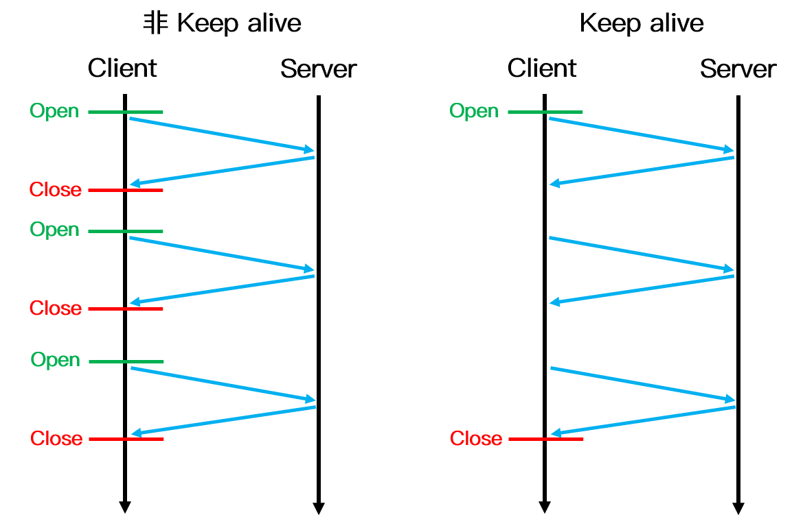

# 应用层

## FQA

### Keep-Alive 和非 Keep-Alive 区别，对服务器性能有影响吗

在早期的 HTTP/1.0 中，浏览器每次 发起 HTTP 请求都要与服务器创建一个新的 TCP 连接，服务器完成请求处理后立即断开 TCP 连接，
服务器不跟踪每个客户也不记录过去的请求。然而创建和关闭连接的过程需要消耗资源和时间，为了减少资源消耗，缩短响应时间，就需要重用连接。
在 HTTP/1.1 版本中默认使用持久连接，在此之前的 HTTP 版本的默认连接都是使用非持久连接，如果想要在旧版本的 HTTP 协议上维持持久连接，
则需要指定 connection 的首部字段的值为 Keep-Alive 来告诉对方这个请求响应完成后不要关闭，下一次咱们还用这个请求继续交流，
我们用一个示意图来更加生动的表示两者的区别：

对于非 Keep-Alive 来说，必须为每一个请求的对象建立和维护一个全新的连接。
对于每一个这样的连接，客户机和服务器都要分配 TCP 的缓冲区和变量，这给服务器带来的严重的负担，
因为一台 Web 服务器可能同时服务于数以百计的客户机请求。在 Keep-Alive 方式下，服务器在响应后保持该 TCP 连接打开，
在同一个客户机与服务器之间的后续请求和响应报文可通过相同的连接进行传送。
甚至位于同一台服务器的多个 Web 页面在从该服务器发送给同一个客户机时，可以在单个持久 TCP 连接上进行。

然而，Keep-Alive 并不是没有缺点的，当长时间的保持 TCP 连接时容易导致系统资源被无效占用，
若对 Keep-Alive 模式配置不当，将有可能比非 Keep-Alive 模式带来的损失更大。
因此，我们需要正确地设置 keep-alive timeout 参数，当 TCP 连接在传送完最后一个 HTTP 响应，
该连接会保持 keepalive_timeout 秒，之后就开始关闭这个链接。

### HTTP 长连接短连接使用场景是什么

**长连接**：多用于操作频繁，点对点的通讯，而且客户端连接数目较少的情况。例如即时通讯、网络游戏等。

**短连接**：用户数目较多的Web网站的 HTTP 服务一般用短连接。
例如京东，淘宝这样的大型网站一般客户端数量达到千万级甚至上亿，若采用长连接势必会使得服务端大量的资源被无效占用，所以一般使用的是短连接。

### 怎么知道 HTTP 的报文长度
当响应消息中存在 Content-Length 字段时，我们可以直接根据这个值来判断数据是否接收完成，
例如客户端向服务器请求一个静态页面或者一张图片时，服务器能够很清楚的知道请求内容的大小，
因此可以通过消息首部字段 Content- Length 来告诉客户端需要接收多少数据，但是如果服务器预先不知道请求内容的大小，
例如加载动态页面的时候，就需要使用 Transfer-Encoding: chunked 的方式来代替 Content-Length。

分块传输编码（Chunked transfer encoding）是 HTTP/1.1 中引入的一种数据传输机制，
其允许 HTTP 由服务器发送给客户端的数据可以分成多个部分，当数据分解成一系列数据块发送时，
服务器就可以发送数据而不需要预先知道发送内容的总大小，每一个分块包含十六进制的长度值和数据，
最后一个分块长度值为0，表示实体结束，客户机可以以此为标志确认数据已经接收完毕。

