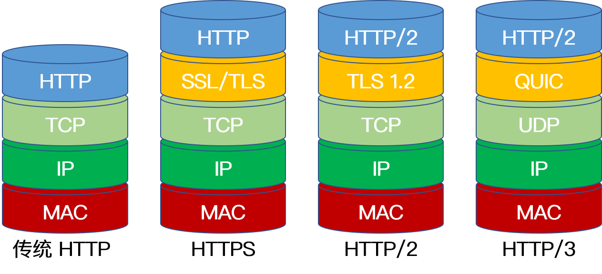

# 应用层

+ [基本概念](#基本概念)
    + [HTTP 头部](#http-头部)
    + [HTTP 方法](#http-方法)
    + [状态码](#状态码)
    + [HTTP 与 HTTPs 的工作方式(建立连接的过程)](#http-与-https-的工作方式建立连接的过程)
    + [HTTP/3](#http3)
    + [socket 套接字](#socket-套接字)
+ [FQA](#fqa)
    + [Keep-Alive 和非 Keep-Alive 区别，对服务器性能有影响吗](#keep-alive-和非-keep-alive-区别对服务器性能有影响吗)
    + [HTTP 长连接短连接使用场景是什么](#http-长连接短连接使用场景是什么)
    + [怎么知道 HTTP 的报文长度](#怎么知道-http-的报文长度)
    + [GET 和 POST 的区别](#get-和-post-的区别)
    + [GET 的长度限制是多少](#get-的长度限制是多少)
    + [HTTPS 和 HTTP 的区别](#https-和-http-的区别)
    + [HTTPS 的加密方式](#https-的加密方式)
    + [客户端为什么信任第三方证书](#客户端为什么信任第三方证书)
    + [状态码 301 和 302 的区别](#状态码-301-和-302-的区别)
    + [HTTP 是不保存状态的协议,如何保存用户状态](#http-是不保存状态的协议如何保存用户状态)
    + [HTTP/1.1 和 HTTP/1.0 的区别](#http11-和-http10-的区别)
    + [HTTP/1.X 和 HTTP/2.0 的区别](#http1x-和-http20-的区别)
    + [网页解析全过程(用户输入网址到显示对应页面的全过程)](#网页解析全过程用户输入网址到显示对应页面的全过程)
  

## 基本概念

### HTTP 头部

通用头部

| 协议头            | 说明                                                                                     | 举例                                           |
|-------------------|------------------------------------------------------------------------------------------|------------------------------------------------|
| Cache-Control     | 用来指定当前的请求/回复中是否使用缓存机制                                                | Cache-Control: no-store                        |
| Connection        | 客户端（浏览器）想要优先使用的连接类型                                                   | Connection: keep-alive (Upgrade)               |
| Date              | 报文创建时间                                                                             | Date: Dec, 26 Dec 2015 17: 30: 00 GMT          |
| Trailer           | 会实现说明在报文主体后记录哪些首部字段，该首部字段可以使用在 HTTP/1.1 版本分块传输编码时 | Trailer: Expiress                              |
| Transfer-Encoding | 用来改变报文格式                                                                         | Transfer-Encoding: chunked                     |
| Upgrade           | 要求服务器升级到一个高版本协议                                                           | Upgrade: HTTP/2.0, SHTTP/1.3, IRC/6.9, RTA/x11 |
| Via               | 告诉服务器，这个请求是由哪些代理发出的                                                   | Via: 1.0 fred, 1.1 itbilu.com.com (Apache/1.1) |
| Warning           | 一个一般性的警告，表示在实体内容中可能存在错误                                           | Warning: 199 Miscellaneous warning             |

请求头部

| 协议头            | 说明                                                                                     | 举例                                           |
|-------------------|------------------------------------------------------------------------------------------|------------------------------------------------|
| Cache-Control     | 用来指定当前的请求/回复中是否使用缓存机制                                                | Cache-Control: no-store                        |
| Connection        | 客户端（浏览器）想要优先使用的连接类型                                                   | Connection: keep-alive (Upgrade)               |
| Date              | 报文创建时间                                                                             | Date: Dec, 26 Dec 2015 17: 30: 00 GMT          |
| Trailer           | 会实现说明在报文主体后记录哪些首部字段，该首部字段可以使用在 HTTP/1.1 版本分块传输编码时 | Trailer: Expiress                              |
| Transfer-Encoding | 用来改变报文格式                                                                         | Transfer-Encoding: chunked                     |
| Upgrade           | 要求服务器升级到一个高版本协议                                                           | Upgrade: HTTP/2.0, SHTTP/1.3, IRC/6.9, RTA/x11 |
| Via               | 告诉服务器，这个请求是由哪些代理发出的                                                   | Via: 1.0 fred, 1.1 itbilu.com.com (Apache/1.1) |
| Warning           | 一个一般性的警告，表示在实体内容中可能存在错误                                           | Warning: 199 Miscellaneous warning             |

响应头部

| 协议头            | 说明                                                                                     | 举例                                           |
|-------------------|------------------------------------------------------------------------------------------|------------------------------------------------|
| Cache-Control     | 用来指定当前的请求/回复中是否使用缓存机制                                                | Cache-Control: no-store                        |
| Connection        | 客户端（浏览器）想要优先使用的连接类型                                                   | Connection: keep-alive (Upgrade)               |
| Date              | 报文创建时间                                                                             | Date: Dec, 26 Dec 2015 17: 30: 00 GMT          |
| Trailer           | 会实现说明在报文主体后记录哪些首部字段，该首部字段可以使用在 HTTP/1.1 版本分块传输编码时 | Trailer: Expiress                              |
| Transfer-Encoding | 用来改变报文格式                                                                         | Transfer-Encoding: chunked                     |
| Upgrade           | 要求服务器升级到一个高版本协议                                                           | Upgrade: HTTP/2.0, SHTTP/1.3, IRC/6.9, RTA/x11 |
| Via               | 告诉服务器，这个请求是由哪些代理发出的                                                   | Via: 1.0 fred, 1.1 itbilu.com.com (Apache/1.1) |
| Warning           | 一个一般性的警告，表示在实体内容中可能存在错误                                           | Warning: 199 Miscellaneous warning             |

实体头部

| 协议头            | 说明                                                                                     | 举例                                           |
|-------------------|------------------------------------------------------------------------------------------|------------------------------------------------|
| Cache-Control     | 用来指定当前的请求/回复中是否使用缓存机制                                                | Cache-Control: no-store                        |
| Connection        | 客户端（浏览器）想要优先使用的连接类型                                                   | Connection: keep-alive (Upgrade)               |
| Date              | 报文创建时间                                                                             | Date: Dec, 26 Dec 2015 17: 30: 00 GMT          |
| Trailer           | 会实现说明在报文主体后记录哪些首部字段，该首部字段可以使用在 HTTP/1.1 版本分块传输编码时 | Trailer: Expiress                              |
| Transfer-Encoding | 用来改变报文格式                                                                         | Transfer-Encoding: chunked                     |
| Upgrade           | 要求服务器升级到一个高版本协议                                                           | Upgrade: HTTP/2.0, SHTTP/1.3, IRC/6.9, RTA/x11 |
| Via               | 告诉服务器，这个请求是由哪些代理发出的                                                   | Via: 1.0 fred, 1.1 itbilu.com.com (Apache/1.1) |
| Warning           | 一个一般性的警告，表示在实体内容中可能存在错误                                           | Warning: 199 Miscellaneous warning             |

### HTTP 方法

HTTP/1.0 定义了三种请求方法：GET, POST 和 HEAD 方法。

HTTP/1.1 增加了六种请求方法：OPTIONS, PUT, PATCH, DELETE, TRACE 和 CONNECT 方法。

| 方法    | 描述                                                                                                                                  |
|---------|---------------------------------------------------------------------------------------------------------------------------------------|
| GET     | 请求指定的页面信息，并返回具体内容，通常只用于读取数据。                                                                              |
| HEAD    | 类似于 GET 请求，只不过返回的响应中没有具体的内容，用于获取报头。                                                                     |
| POST    | 向指定资源提交数据进行处理请求（例如提交表单或者上传文件）。数据被包含在请求体中。POST 请求可能会导致新的资源的建立或已有资源的更改。 |
| PUT     | 替换指定的资源，没有的话就新增。                                                                                                      |
| DELETE  | 请求服务器删除 URL 标识的资源数据。                                                                                                   |
| CONNECT | 将服务器作为代理，让服务器代替用户进行访问。                                                                                          |
| OPTIONS | 向服务器发送该方法，会返回对指定资源所支持的 HTTP 请求方法。                                                                          |
| TRACE   | 回显服务器收到的请求数据，即服务器返回自己收到的数据，主要用于测试和诊断。                                                            |
| PATCH   | 是对 PUT 方法的补充，用来对已知资源进行局部更新。                                                                                     |

### 状态码

HTTP 状态码由三个十进制数字组成，第一个数字定义了状态码的类型，后两个并没有起到分类的作用。HTTP 状态码共有 5 种类型：

| 方法    | 描述                                                                                                                                  |
|---------|---------------------------------------------------------------------------------------------------------------------------------------|
| GET     | 请求指定的页面信息，并返回具体内容，通常只用于读取数据。                                                                              |
| HEAD    | 类似于 GET 请求，只不过返回的响应中没有具体的内容，用于获取报头。                                                                     |
| POST    | 向指定资源提交数据进行处理请求（例如提交表单或者上传文件）。数据被包含在请求体中。POST 请求可能会导致新的资源的建立或已有资源的更改。 |
| PUT     | 替换指定的资源，没有的话就新增。                                                                                                      |
| DELETE  | 请求服务器删除 URL 标识的资源数据。                                                                                                   |
| CONNECT | 将服务器作为代理，让服务器代替用户进行访问。                                                                                          |
| OPTIONS | 向服务器发送该方法，会返回对指定资源所支持的 HTTP 请求方法。                                                                          |
| TRACE   | 回显服务器收到的请求数据，即服务器返回自己收到的数据，主要用于测试和诊断。                                                            |
| PATCH   | 是对 PUT 方法的补充，用来对已知资源进行局部更新。                                                                                     |

相应的 HTTP 状态码列表：

| 方法    | 描述                                                                                                                                  |
|---------|---------------------------------------------------------------------------------------------------------------------------------------|
| GET     | 请求指定的页面信息，并返回具体内容，通常只用于读取数据。                                                                              |
| HEAD    | 类似于 GET 请求，只不过返回的响应中没有具体的内容，用于获取报头。                                                                     |
| POST    | 向指定资源提交数据进行处理请求（例如提交表单或者上传文件）。数据被包含在请求体中。POST 请求可能会导致新的资源的建立或已有资源的更改。 |
| PUT     | 替换指定的资源，没有的话就新增。                                                                                                      |
| DELETE  | 请求服务器删除 URL 标识的资源数据。                                                                                                   |
| CONNECT | 将服务器作为代理，让服务器代替用户进行访问。                                                                                          |
| OPTIONS | 向服务器发送该方法，会返回对指定资源所支持的 HTTP 请求方法。                                                                          |
| TRACE   | 回显服务器收到的请求数据，即服务器返回自己收到的数据，主要用于测试和诊断。                                                            |
| PATCH   | 是对 PUT 方法的补充，用来对已知资源进行局部更新。                                                                                     |

### HTTP 与 HTTPs 的工作方式(建立连接的过程)

**HTTP**（Hyper Text Transfer Protocol: 超文本传输协议） 是一种简单的请求 - 响应协议，被用于在 Web 浏览器和网站服务器之间传递消息。HTTP 使用 TCP（而不是
UDP）作为它的支撑运输层协议。其默认工作在 TCP 协议 80 端口，HTTP 客户机发起一个与服务器的 TCP 连接，一旦连接建立，浏览器和服务器进程就可以通过套接字接口访问 TCP。客户机从套接字接口发送 HTTP 请求报文和接收
HTTP 响应报文。类似地，服务器也是从套接字接口接收 HTTP 请求报文和发送 HTTP 响应报文。其通信内容以明文的方式发送，不通过任何方式的数据加密。当通信结束时，客户端与服务器关闭连接。

**HTTPS**（Hyper Text Transfer Protocol over Secure Socket Layer）是以安全为目标的 HTTP 协议，在 HTTP
的基础上通过传输加密和身份认证的方式保证了传输过程的安全性。其工作流程如下：

1. 客户端发起一个 HTTPS 请求，并连接到服务器的 443 端口，发送的信息主要包括自身所支持的算法列表和密钥长度等；
2. 服务端将自身所支持的所有加密算法与客户端的算法列表进行对比并选择一种支持的加密算法，然后将它和其它密钥组件一同发送给客户端。
3. 服务器向客户端发送一个包含数字证书的报文，该数字证书中包含证书的颁发机构、过期时间、服务端的公钥等信息。
4. 最后服务端发送一个完成报文通知客户端 SSL 的第一阶段已经协商完成。
5. SSL 第一次协商完成后，客户端发送一个回应报文，报文中包含一个客户端生成的随机密码串，称为 pre_master_secret，并且该报文是经过证书中的公钥加密过的。
6. 紧接着客户端会发送一个报文提示服务端在此之后的报文是采用 pre_master_secret 加密的。
7. 客户端向服务端发送一个 finish 报文，这次握手中包含第一次握手至今所有报文的整体校验值，最终协商是否完成取决于服务端能否成功解密。
8. 服务端同样发送与第 6 步中相同作用的报文，已让客户端进行确认，最后发送 finish 报文告诉客户端自己能够正确解密报文。

当服务端和客户端的 finish 报文交换完成之后，SSL 连接就算建立完成了，之后就进行和 HTTP 相同的通信过程，唯一不同的是在 HTTP 通信过程中并不是采用明文传输，而是采用对称加密的方式，其中对称密钥已经在 SSL
的建立过程中协商好了。

### HTTP/3

**HTTP/2 存在的问题**:
我们知道，传统 Web 平台的数据传输都基于 TCP 协议，而 TCP 协议在创建连接之前不可避免的需要三次握手，如果需要提高数据交互的安全性，即增加传输层安全协议（TLS），还会增加更多的握手次数。 HTTP 从 1.0 到
2.0，其传输层都是基于 TCP 协议的。即使是带来巨大性能提升的 HTTP/2，也无法完全解决 TCP 协议存在的固有问题（慢启动，拥塞窗口尺寸的设置等）。此外，HTTP/2 多路复用只是减少了连接数，其队头的拥塞问题并没有完全解决，倘若
TCP 丢包率过大，则 HTTP/2 的表现将不如 HTTP/1.1。

**QUIC 协议**:
QUIC（Quick UDP Internet Connections），直译为快速 UDP 网络连接，是谷歌制定的一种基于 UDP 的低延迟传输协议。其主要目的是解决采用传输层 TCP
协议存在的问题，同时满足传输层和应用层对多连接、低延迟等的需求。该协议融合了 TCP, TLS, HTTP/2 等协议的特性，并基于 UDP传输。该协议带来的主要提升有：

+ 低延迟连接。当客户端第一次连接服务器时，QUIC 只需要 1 RTT（Round-Trid Time）延迟就可以建立安全可靠的连接（采用 TLS 1.3 版本），相比于 TCP + TLS 的 3 次 RTT
  要更加快捷。之后，客户端可以在本地缓存加密的认证信息，当再次与服务器建立连接时可以实现 0 RTT 的连接建立延迟。
+ QUIC 复用了 HTTP/2 协议的多路复用功能，由于 QUIC 基于 UDP，所以也避免了 HTTP/2存在的队头阻塞问题。
+ 基于 UDP 协议的 QUIC 运行在用户域而不是系统内核，这使得 QUIC 协议可以快速的更新和部署，从而很好地解决了 TPC 协议部署及更新的困难。
+ QUIC 的报文是经过加密和认证的，除了少量的报文，其它所有的 QUIC 报文头部都经过了认证，报文主体经过了加密。只要有攻击者篡改 QUIC 报文，接收端都能及时发现。
+ 具有向前纠错机制，每个数据包携带了除了本身内容外的部分其他数据包的内容，使得在出现少量丢包的情况下，尽量地减少其它包的重传次数，其通过牺牲单个包所携带的有效数据大小换来更少的重传次数，这在丢包数量较小的场景下能够带来一定程度的性能提升。

**HTTP/3**:

HTTP/3 是在 QUIC 基础上发展起来的，其底层使用 UDP 进行数据传输，上层仍然使用 HTTP/2。在 UDP 与 HTTP/2 之间存在一个 QUIC 层，其中 TLS 加密过程在该层进行处理。HTTP/3 主要有以下几个特点：

+ 使用 UDP 作为传输层进行通信；
+ 在 UDP 之上的 QUIC 协议保证了 HTTP/3 的安全性。QUIC 在建立连接的过程中就完成了 TLS 加密握手；
+ 建立连接快，正常只需要 1 RTT 即可建立连接。如果有缓存之前的会话信息，则直接验证和建立连接，此过程 0 RTT。建立连接时，也可以带有少量业务数据；
+ 不和具体底层连接绑定，QUIC 为每个连接的两端分别分配了一个唯一 ID，上层连接只认这对逻辑 ID。网络切换或者断连时，只需要继续发送数据包即可完成连接的建立；
+ 使用 QPACK 进行头部压缩，因为 在 HTTP/2 中的 HPACK 要求传输过程有序，这会导致队头阻塞，而 QPACK 不存在这个问题。

使用一张图来清晰的表示出 HTTP 协议的发展变化：

### socket 套接字

套接字（Socket）是对网络中不同主机上的应用进程之间进行双向通信的端点的抽象，网络进程通信的一端就是一个套接字，不同主机上的进程便是通过套接字发送报文来进行通信。例如 TCP 用主机的 IP 地址 + 端口号作为 TCP
连接的端点，这个端点就叫做套接字。

套接字主要有以下三种类型：

+ 流套接字（SOCK_STREAM）：流套接字基于 TCP 传输协议，主要用于提供面向连接、可靠的数据传输服务。由于 TCP
  协议的特点，使用流套接字进行通信时能够保证数据无差错、无重复传送，并按顺序接收，通信双方不需要在程序中进行相应的处理。
+ 数据报套接字（SOCK_DGRAM）：和流套接字不同，数据报套接字基于 UDP 传输协议，对应于无连接的 UDP 服务应用。该服务并不能保证数据传输的可靠性，也无法保证对端能够顺序接收到数据。此外，通信两端不需建立长时间的连接关系，当
  UDP 客户端发送一个数据给服务器后，其可以通过同一个套接字给另一个服务器发送数据。当用 UDP 套接字时，丢包等问题需要在程序中进行处理。
+ 原始套接字（SOCK_RAW）：由于流套接字和数据报套接字只能读取 TCP 和 UDP 协议的数据，当需要传送非传输层数据包（例如 Ping 命令时用的 ICMP
  协议数据包）或者遇到操作系统无法处理的数据包时，此时就需要建立原始套接字来发送。

---

## FQA

### Keep-Alive 和非 Keep-Alive 区别，对服务器性能有影响吗

在早期的 HTTP/1.0 中，浏览器每次 发起 HTTP 请求都要与服务器创建一个新的 TCP 连接，服务器完成请求处理后立即断开 TCP 连接，
服务器不跟踪每个客户也不记录过去的请求。然而创建和关闭连接的过程需要消耗资源和时间，为了减少资源消耗，缩短响应时间，就需要重用连接。 在 HTTP/1.1 版本中默认使用持久连接，在此之前的 HTTP
版本的默认连接都是使用非持久连接，如果想要在旧版本的 HTTP 协议上维持持久连接， 则需要指定 connection 的首部字段的值为 Keep-Alive 来告诉对方这个请求响应完成后不要关闭，下一次咱们还用这个请求继续交流，
我们用一个示意图来更加生动的表示两者的区别：

对于非 Keep-Alive 来说，必须为每一个请求的对象建立和维护一个全新的连接。 对于每一个这样的连接，客户机和服务器都要分配 TCP 的缓冲区和变量，这给服务器带来的严重的负担， 因为一台 Web
服务器可能同时服务于数以百计的客户机请求。在 Keep-Alive 方式下，服务器在响应后保持该 TCP 连接打开， 在同一个客户机与服务器之间的后续请求和响应报文可通过相同的连接进行传送。 甚至位于同一台服务器的多个 Web
页面在从该服务器发送给同一个客户机时，可以在单个持久 TCP 连接上进行。

然而，Keep-Alive 并不是没有缺点的，当长时间的保持 TCP 连接时容易导致系统资源被无效占用， 若对 Keep-Alive 模式配置不当，将有可能比非 Keep-Alive 模式带来的损失更大。 因此，我们需要正确地设置
keep-alive timeout 参数，当 TCP 连接在传送完最后一个 HTTP 响应， 该连接会保持 keepalive_timeout 秒，之后就开始关闭这个链接。

### HTTP 长连接短连接使用场景是什么

**长连接**：多用于操作频繁，点对点的通讯，而且客户端连接数目较少的情况。例如即时通讯、网络游戏等。

**短连接**：用户数目较多的Web网站的 HTTP 服务一般用短连接。 例如京东，淘宝这样的大型网站一般客户端数量达到千万级甚至上亿，若采用长连接势必会使得服务端大量的资源被无效占用，所以一般使用的是短连接。

### 怎么知道 HTTP 的报文长度

当响应消息中存在 Content-Length 字段时，我们可以直接根据这个值来判断数据是否接收完成， 例如客户端向服务器请求一个静态页面或者一张图片时，服务器能够很清楚的知道请求内容的大小， 因此可以通过消息首部字段 Content-
Length 来告诉客户端需要接收多少数据，但是如果服务器预先不知道请求内容的大小， 例如加载动态页面的时候，就需要使用 Transfer-Encoding: chunked 的方式来代替 Content-Length。

分块传输编码（Chunked transfer encoding）是 HTTP/1.1 中引入的一种数据传输机制， 其允许 HTTP 由服务器发送给客户端的数据可以分成多个部分，当数据分解成一系列数据块发送时，
服务器就可以发送数据而不需要预先知道发送内容的总大小，每一个分块包含十六进制的长度值和数据， 最后一个分块长度值为0，表示实体结束，客户机可以以此为标志确认数据已经接收完毕。

### GET 和 POST 的区别

+ get 提交的数据会放在 URL 之后，并且请求参数会被完整的保留在浏览器的记录里，由于参数直接暴露在 URL 中，可能会存在安全问题，因此往往用于获取资源信息。 而 post 参数放在请求主体中，并且参数不会被保留，相比 get
  方法，post 方法更安全，主要用于修改服务器上的资源。
+ get 请求只支持 URL 编码，post 请求支持多种编码格式。
+ get 只支持 ASCII 字符格式的参数，而 post 方法没有限制。
+ get 提交的数据大小有限制（这里所说的限制是针对浏览器而言的），而 post 方法提交的数据没限制
+ get 方式需要使用 Request.QueryString 来取得变量的值，而 post 方式通过 Request.Form 来获取。
+ get 方法产生一个 TCP 数据包，post 方法产生两个（并不是所有的浏览器中都产生两个）。

### GET 的长度限制是多少

HTTP 中的 GET 方法是通过 URL 传递数据的，而 URL 本身并没有对数据的长度进行限制，真正限制 GET 长度的是浏览器，例如 IE 浏览器对 URL 的最大限制为 2000多个字符，大概 2KB左右，像 Chrome,
FireFox 等浏览器能支持的 URL 字符数更多，其中 FireFox 中 URL 最大长度限制为 65536 个字符，Chrome 浏览器中 URL 最大长度限制为 8182 个字符。并且这个长度不是只针对数据部分，而是针对整个
URL 而言，在这之中，不同的服务器同样影响 URL 的最大长度限制。因此对于特定的浏览器，GET的长度限制不同。

由于 POST 方法请求参数在请求主体中，理论上讲，post 方法是没有大小限制的，而真正起限制作用的是服务器处理程序的处理能力。

### HTTPS 和 HTTP 的区别

+ HTTP 协议以明文方式发送内容，数据都是未加密的，安全性较差。HTTPS 数据传输过程是加密的，安全性较好。
+ HTTP 和 HTTPS 使用的是完全不同的连接方式，用的端口也不一样，前者是 80 端口，后者是 443 端口。
+ HTTPS 协议需要到数字认证机构（Certificate Authority, CA）申请证书，一般需要一定的费用。
+ HTTP 页面响应比 HTTPS 快，主要因为 HTTP 使用 3 次握手建立连接，客户端和服务器需要握手 3 次，而 HTTPS 除了 TCP 的 3 次握手，还需要经历一个 SSL 协商过程。

### HTTPS 的加密方式

HTTPS 采用对称加密和非对称加密相结合的方式，首先使用 SSL/TLS 协议进行加密传输，为了弥补非对称加密的缺点，HTTPS
采用证书来进一步加强非对称加密的安全性，通过非对称加密，客户端和服务端协商好之后进行通信传输的对称密钥，后续的所有信息都通过该对称秘钥进行加密解密，完成整个 HTTPS 的流程。

### 客户端为什么信任第三方证书

假设中间人篡改了证书原文，由于他没有 CA 机构的私钥，所以无法得到此时加密后的签名，因此无法篡改签名。客户端浏览器收到该证书后会发现原文和签名解密后的值不一致，则说明证书被中间人篡改，证书不可信，从而终止向服务器传输信息。

上述过程说明证书无法被篡改，我们考虑更严重的情况，例如中间人拿到了 CA 机构认证的证书，它想窃取网站 A 发送给客户端的信息，于是它成为中间人拦截到了 A
传给客户端的证书，然后将其替换为自己的证书。此时客户端浏览器收到的是被中间人掉包后的证书，但由于证书里包含了客户端请求的网站信息，因此客户端浏览器只需要把证书里的域名与自己请求的域名比对一下就知道证书有没有被掉包了。

### 状态码 301 和 302 的区别

**301**: 永久移动。请求的资源已被永久的移动到新的URI，旧的地址已经被永久的删除了。返回信息会包括新的URI，浏览器会自动定向到新的URI。今后新的请求都应使用新的URI代替。

**302**：临时移动。与301类似，客户端拿到服务端的响应消息后会跳转到一个新的 URL 地址。但资源只是临时被移动，旧的地址还在，客户端应继续使用原有URI。

### HTTP 是不保存状态的协议,如何保存用户状态

我们知道，假如某个特定的客户机在短时间内两次请求同一个对象，服务器并不会因为刚刚为该用户提供了该对象就不再做出反应，而是重新发送该对象，就像该服务器已经完全忘记不久之前所做过的是一样。因为一个 HTTP
服务器并不保存关于客户机的任何信息，所以我们说 HTTP 是一个无状态协议。

通常有两种解决方案：

1. 基于 Session 实现的会话保持。

在客户端第一次向服务器发送 HTTP 请求后，服务器会创建一个 Session 对象并将客户端的身份信息以键值对的形式存储下来，然后分配一个会话标识（SessionId）给客户端，这个会话标识一般保存在客户端 Cookie
中，之后每次该浏览器发送 HTTP 请求都会带上 Cookie 中的 SessionId 到服务器，服务器根据会话标识就可以将之前的状态信息与会话联系起来，从而实现会话保持。

优点：安全性高，因为状态信息保存在服务器端。

缺点：由于大型网站往往采用的是分布式服务器，浏览器发送的 HTTP 请求一般要先通过负载均衡器才能到达具体的后台服务器，倘若同一个浏览器两次 HTTP 请求分别落在不同的服务器上时，基于 Session 的方法就不能实现会话保持了。

【解决方法：采用中间件，例如 Redis，我们通过将 Session 的信息存储在 Redis 中，使得每个服务器都可以访问到之前的状态信息】

2. 基于 Cookie 实现的会话保持

当服务器发送响应消息时，在 HTTP 响应头中设置 Set-Cookie 字段，用来存储客户端的状态信息。客户端解析出 HTTP 响应头中的字段信息，并根据其生命周期创建不同的 Cookie，这样一来每次浏览器发送 HTTP
请求的时候都会带上 Cookie 字段，从而实现状态保持。基于 Cookie 的会话保持与基于 Session 实现的会话保持最主要的区别是前者完全将会话状态信息存储在浏览器 Cookie 中。

优点：服务器不用保存状态信息， 减轻服务器存储压力，同时便于服务端做水平拓展。

缺点：该方式不够安全，因为状态信息存储在客户端，这意味着不能在会话中保存机密数据。除此之外，浏览器每次发起 HTTP 请求时都需要发送额外的 Cookie 到服务器端，会占用更多带宽。

拓展：Cookie被禁用了怎么办？

若遇到 Cookie 被禁用的情况，则可以通过重写 URL 的方式将会话标识放在 URL 的参数里，也可以实现会话保持。

### HTTP/1.1 和 HTTP/1.0 的区别

+ 缓存处理：在 HTTP/1.0 中主要使用 header 里的 if-modified-Since, Expries 来做缓存判断的标准。而 HTTP/1.1 请求头中添加了更多与缓存相关的字段，从而支持更为灵活的缓存策略，例如
  Entity-tag, If-Unmodified-Since, If-Match, If-None-Match 等可供选择的缓存头来控制缓存策略。
+ 节约带宽： 当客户端请求某个资源时，HTTP/1.0 默认将该资源相关的整个对象传送给请求方，但很多时候可能客户端并不需要对象的所有信息。而在 HTTP/1.1 的请求头中引入了 range
  头域，它允许只请求部分资源，其使得开发者可以多线程请求某一资源，从而充分的利用带宽资源，实现高效并发。
+ 错误通知的管理：HTTP/1.1 在 1.0 的基础上新增了 24 个错误状态响应码，例如 414 表示客户端请求中所包含的 URL 地址太长，以至于服务器无法处理；410 表示所请求的资源已经被永久删除。
+ Host 请求头：早期 HTTP/1.0 中认为每台服务器都绑定一个唯一的 IP 地址并提供单一的服务，请求消息中的 URL 并没有传递主机名。而随着虚拟主机的出现，一台物理服务器上可以存在多个虚拟主机，并且它们共享同一个 IP
  地址。为了支持虚拟主机，HTTP/1.1 中添加了 host 请求头，请求消息和响应消息中应声明这个字段，若请求消息中缺少该字段时服务端会响应一个 404 错误状态码。
+ 长连接：HTTP/1.0 默认浏览器和服务器之间保持短暂连接，浏览器的每次请求都需要与服务器建立一个 TCP 连接，服务器完成后立即断开 TCP 连接。HTTP/1.1 默认使用的是持久连接，其支持在同一个 TCP 请求中传送多个
  HTTP 请求和响应。此之前的 HTTP 版本的默认连接都是使用非持久连接，如果想要在旧版本的 HTTP 协议上维持持久连接，则需要指定 Connection 的首部字段的值为 Keep-Alive。

### HTTP/1.X 和 HTTP/2.0 的区别

+ 相比于 HTTP/1.X 的文本（字符串）传送， HTTP/2.0 采用二进制传送。客户端和服务器传输数据时把数据分成帧，帧组成了数据流，流具有流 ID 标识和优先级，通过优先级以及流依赖能够一定程度上解决关键请求被阻塞的问题。
+ HTTP/2.0 支持多路复用。因为流 ID 的存在， 通过同一个 HTTP 请求可以实现多个 HTTP 请求传输，客户端和服务器可以通过流 ID 来标识究竟是哪个流从而定位到是哪个 HTTP 请求。
+ HTTP/2.0 头部压缩。HTTP/2.0 通过 gzip 和 compress 压缩头部然后再发送，同时通信双方会维护一张头信息表，所有字段都记录在这张表中，在每次 HTTP
  传输时只需要传头字段在表中的索引即可，大大减小了重传次数和数据量。
+ HTTP/2.0 支持服务器推送。 服务器在客户端未经请求许可的情况下，可预先向客户端推送需要的内容，客户端在退出服务时可通过发送复位相关的请求来取消服务端的推送。

### 为什么 fidder，charles 能抓到你的包(抓取数据包的过程)

假如我们需要抓取客户端的数据包，需要监控客户端与服务器交互之间的网络节点，监控其中任意一个网络节点（网卡），获取所有经过网卡中的数据，对这些数据按照网络协议进行解析，这就是抓包的基本原理。而中间的网络节点不受我们控制，是基本无法实现抓包的，因此只能在客户端与服务器之间进行抓包。

当采用抓包工具抓取 HTTP 数据包时，过程较为简单：

+ 首先抓包工具会提出代理服务，客户端需要连接该代理；
+ 客户端发出 HTTP 请求时，会经过抓包工具的代理，抓包工具将请求的原文进行展示；
+ 抓包工具使用该原文将请求发送给服务器；
+ 服务器返回结果给抓包工具，抓包工具将返回结果进行展示；
+ 抓包工具将服务器返回的结果原样返回给客户端。
+ 这里抓包工具相当于透明人，数据经过的时候它一只手接到数据，然后另一只手把数据传出去。

当抓取 HTTPS 数据包时：

+ 客户端连接抓包工具提供的代理服务，并安装抓包工具的根证书；
+ 客户端发出 HTTPS 请求，抓包工具模拟服务器与客户端进行 TLS 握手交换密钥等流程；
+ 抓包工具发送一个 HTTPS 请求给客户端请求的目标服务器，并与目标服务器进行 TLS 握手交换密钥等流程；
+ 客户端使用与抓包工具协定好的密钥加密数据后发送给抓包工具；
+ 抓包工具使用与客户端协定好的密钥解密数据，并将结果进行展示；
+ 抓包工具将解密后的客户端数据，使用与服务器协定好的密钥进行加密后发送给目标服务器；
+ 服务器解密数据后，做对应的逻辑处理，然后将返回结果使用与抓包工具协定好的密钥进行加密发送给抓包工具；
+ 抓包工具将服务器返回的结果，用与服务器协定好的密钥解密，并将结果进行展示；
+ 抓包工具将解密后的服务器返回数据，使用与客户端协定好的密钥进行加密后发送给客户端；
+ 客户端解密数据。

这个时候抓包工具对客户端来说相当于服务器，对服务器来说相当于客户端。在这个传输过程中，客户端会以为它就是目标服务器，服务器也会以为它就是请求发起的客户端。

### 网页解析全过程(用户输入网址到显示对应页面的全过程)

1. DNS 解析: 当用户输入一个网址并按下回车键的时候，浏览器获得一个域名，而在实际通信过程中，我们需要的是一个 IP 地址，因此我们需要先把域名转换成相应 IP 地址。
2. TCP 连接: 浏览器通过 DNS 获取到 Web 服务器真正的 IP 地址后，便向 Web 服务器发起 TCP 连接请求，通过 TCP 三次握手建立好连接后，浏览器便可以将 HTTP 请求数据发送给服务器了。
3. 发送 HTTP 请求: 浏览器向 Web 服务器发起一个 HTTP 请求，HTTP 协议是建立在 TCP
   协议之上的应用层协议，其本质是在建立起的TCP连接中，按照HTTP协议标准发送一个索要网页的请求。在这一过程中，会涉及到负载均衡等操作。
4. 处理请求并返回: 服务器获取到客户端的 HTTP 请求后，会根据 HTTP 请求中的内容来决定如何获取相应的文件，并将文件发送给浏览器。
5. 浏览器渲染: 浏览器根据响应开始显示页面，首先解析 HTML 文件构建 DOM 树，然后解析 CSS 文件构建渲染树，等到渲染树构建完成后，浏览器开始布局渲染树并将其绘制到屏幕上。
6. 断开连接：客户端和服务器通过四次挥手终止 TCP 连接。

