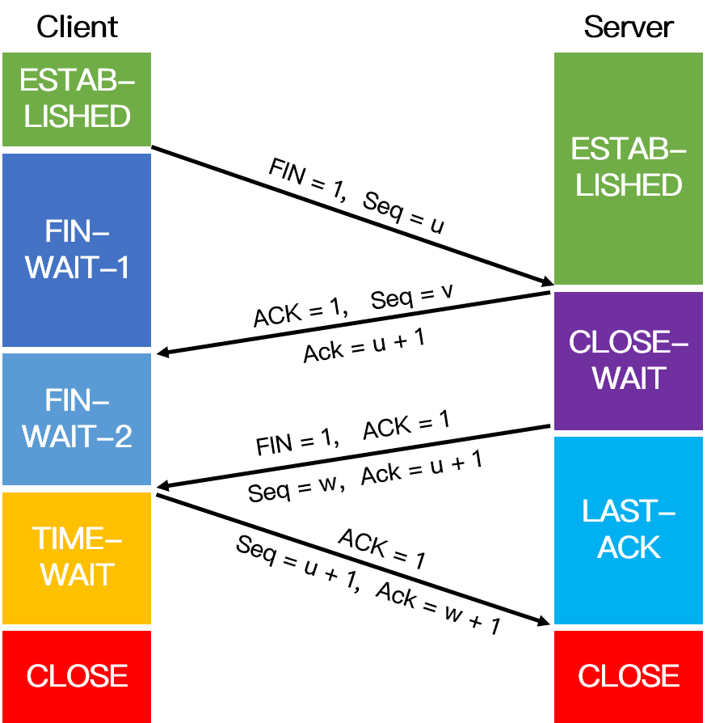

# 传输层

+ [基本概念](#基本概念)
  + [三次握手](#三次握手)
  + [四次挥手](#四次挥手)
  + [TCP 流量控制与拥塞控制](#tcp-流量控制与拥塞控制)
  + [TCP 拥塞控制采用的四种算法](#tcp-拥塞控制采用的四种算法)
+ [FQA](#fqa)
  + [tcp 11 种状态](#tcp-11-种状态)
  + [如果三次握手的时候每次握手信息对方没有收到会怎么样](#如果三次握手的时候每次握手信息对方没有收到会怎么样)
  + [为什么要进行三次握手？两次握手可以吗？](#为什么要进行三次握手两次握手可以吗)
  + [第 2 次握手传回了 ACK，为什么还要传回 SYN](#第-2-次握手传回了-ack为什么还要传回-syn)
  + [为什么要四次挥手？](#为什么要四次挥手)
  + [CLOSE-WAIT 和 TIME-WAIT 的状态和意义](#close-wait-和-time-wait-的状态和意义)
  + [TIME_WAIT 状态会导致什么问题，怎么解决](#time_wait-状态会导致什么问题怎么解决)
  + [TIME-WAIT 为什么是 2MSL](#time-wait-为什么是-2msl)
  + [区分MSL，RTT，TTL](#区分mslrttttl)
  + [有很多 TIME-WAIT 状态如何解决](#有很多-time-wait-状态如何解决)
  + [有很多 CLOSE-WAIT 怎么解决](#有很多-close-wait-怎么解决)
  + [TCP 和 UDP 的区别](#tcp-和-udp-的区别)
  + [TCP 协议中的定时器](#tcp-协议中的定时器)
  + [TCP 是如何保证可靠性的](#tcp-是如何保证可靠性的)
  + [UDP 为什么是不可靠的？bind 和 connect 对于 UDP 的作用是什么](#udp-为什么是不可靠的bind-和-connect-对于-udp-的作用是什么)
  + [TCP 超时重传的原理](#tcp-超时重传的原理)
  + [TCP 的停止等待协议是什么](#tcp-的停止等待协议是什么)
  + [TCP 最大连接数限制](#tcp-最大连接数限制)
  + [如果接收方滑动窗口满了，发送方会怎么做](#如果接收方滑动窗口满了发送方会怎么做)
  + [TCP 粘包问题](#tcp-粘包问题)
  + [TCP 报文包含哪些信息](#tcp-报文包含哪些信息)
  + [SYN FLOOD 是什么](#syn-flood-是什么)
  + [为什么服务端易受到 SYN 攻击](#为什么服务端易受到-syn-攻击)
  + [高并发服务器客户端主动关闭连接和服务端主动关闭连接的区别](#高并发服务器客户端主动关闭连接和服务端主动关闭连接的区别)

## 基本概念

### 三次握手

### 四次挥手

### TCP 流量控制与拥塞控制

**流量控制**

所谓流量控制就是让发送方的发送速率不要太快，让接收方来得及接收。如果接收方来不及接收发送方发送的数据，那么就会有分组丢失。在 TCP 中利用可边长的滑动窗口机制可以很方便的在 TCP 连接上实现对发送方的流量控制。主要的方式是接收方返回的
ACK 中会包含自己的接收窗口大小，以控制发送方此次发送的数据量大小（发送窗口大小）。

**拥塞控制**

在实际的网络通信系统中，除了发送方和接收方外，还有路由器，交换机等复杂的网络传输线路，此时就需要拥塞控制。拥塞控制是作用于网络的，它是防止过多的数据注入到网络中，避免出现网络负载过大的情况。常用的解决方法有：慢开始和拥塞避免、快重传和快恢复。

**拥塞控制和流量控制的区别**

拥塞控制往往是一种全局的，防止过多的数据注入到网络之中，而TCP连接的端点只要不能收到对方的确认信息，猜想在网络中发生了拥塞，但并不知道发生在何处，因此，流量控制往往指点对点通信量的控制，是端到端的问题。

### TCP 拥塞控制采用的四种算法

**慢启动**

当发送方开始发送数据时，由于一开始不知道网络负荷情况，如果立即将大量的数据字节传输到网络中，那么就有可能引起网络拥塞。一个较好的方法是在一开始发送少量的数据先探测一下网络状况，即由小到大的增大发送窗口（拥塞窗口
cwnd）。慢启动的慢指的是初始时令 cwnd为 1，即一开始发送一个报文段。如果收到确认，则 cwnd = 2，之后每收到一个确认报文，就令 cwnd = cwnd* 2。

但是，为了防止拥塞窗口增长过大而引起网络拥塞，另外设置了一个慢启动阈值 ssthresh。

1. 当 cwnd < ssthresh 时，使用上述的慢启动算法；
2. 当 cwnd > ssthresh 时，停止使用慢启动，转而使用拥塞控制算法；
3. 当 cwnd == ssthresh 时，两者均可。

**拥塞控制**

拥塞控制是为了让拥塞窗口 cwnd 缓慢地增大，即每经过一个往返时间 RTT （往返时间定义为发送方发送数据到收到确认报文所经历的时间）就把发送方的 cwnd 值加 1，通过让 cwnd 线性增长，防止很快就遇到网络拥塞状态。

当网络拥塞发生时，让新的慢启动阈值变为发生拥塞时候的值的一半,并将拥塞窗口置为 1 ,然后再次重复两种算法（慢启动和拥塞避免）,这时一瞬间会将网络中的数据量大量降低。

**快重传**

快重传算法要求接收方每收到一个失序的报文就立即发送重复确认，而不要等到自己发送数据时才捎带进行确认，假定发送方发送了 Msg 1 ~ Msg 4 这 4 个报文，已知接收方收到了 Msg 1，Msg 3 和 Msg 4
报文，此时因为接收到收到了失序的数据包，按照快重传的约定，接收方应立即向发送方发送 Msg 1 的重复确认。 于是在接收方收到 Msg 4 报文的时候，向发送方发送的仍然是 Msg 1 的重复确认。这样，发送方就收到了 3 次 Msg 1
的重复确认，于是立即重传对方未收到的 Msg 报文。由于发送方尽早重传未被确认的报文段，因此，快重传算法可以提高网络的吞吐量。

**快恢复**

快恢复算法是和快重传算法配合使用的，该算法主要有以下两个要点：

1. 当发送方连续收到三个重复确认，执行乘法减小，慢开始门限 ssthresh 值减半；
2. 由于发送方可能认为网络现在没有拥塞，因此与慢开始不同，把 cwnd 值设置为 ssthresh 减半之后的值，然后执行拥塞避免算法，线性增大 cwnd。

## FQA

### tcp 11 种状态

客户端独有的:

+ YN_SENT
+ FIN_WAIT1
+ FIN_WAIT2
+ CLOSING
+ TIME_WAIT

服务端独有的:

+ LISTEN
+ SYN_RECV
+ CLOSE_WAIT
+ LAST_ACK

共有的:

+ CLOSED
+ ESTABLISHED

### 如果三次握手的时候每次握手信息对方没有收到会怎么样

+ 若第一次握手服务器未接收到客户端请求建立连接的数据包时，服务器不会进行任何相应的动作，而客户端由于在一段时间内没有收到服务器发来的确认报文， 因此会等待一段时间后重新发送 SYN
  同步报文，若仍然没有回应，则重复上述过程直到发送次数超过最大重传次数限制后，建立连接的系统调用会返回 -1。
+ 若第二次握手客户端未接收到服务器回应的 ACK 报文时，客户端会采取第一次握手失败时的动作，这里不再重复，而服务器端此时将阻塞在 accept() 系统调用处等待 client 再次发送 ACK 报文。
+ 若第三次握手服务器未接收到客户端发送过来的 ACK 报文，同样会采取类似于客户端的超时重传机制，若重传次数超过限制后仍然没有回应，则 accep() 系统调用返回
  -1，服务器端连接建立失败。但此时客户端认为自己已经连接成功了，因此开始向服务器端发送数据，但是服务器端的 accept() 系统调用已返回，此时没有在监听状态。因此服务器端接收到来自客户端发送来的数据时会发送 RST 报文给
  客户端，消除客户端单方面建立连接的状态。

### 为什么要进行三次握手？两次握手可以吗？

三次握手的主要目的是确认自己和对方的发送和接收都是正常的，从而保证了双方能够进行可靠通信。若采用两次握手，当第二次握手后就建立连接的话，此时客户端知道服务器能够正常接收到自己发送的数据，而服务器并不知道客户端是否能够收到自己发送的数据。

我们知道网络往往是非理想状态的（存在丢包和延迟），当客户端发起创建连接的请求时，如果服务器直接创建了这个连接并返回包含 SYN、ACK 和 Seq
等内容的数据包给客户端，这个数据包因为网络传输的原因丢失了，丢失之后客户端就一直接收不到返回的数据包。由于客户端可能设置了一个超时时间，一段时间后就关闭了连接建立的请求，再重新发起新的请求，而服务器端是不知道的，如果没有第三次握手告诉服务器客户端能否收到服务器传输的数据的话，服务器端的端口就会一直开着，等到客户端因超时重新发出请求时，服务器就会重新开启一个端口连接。长此以往，
这样的端口越来越多，就会造成服务器开销的浪费。

### 第 2 次握手传回了 ACK，为什么还要传回 SYN

ACK 是为了告诉客户端发来的数据已经接收无误，而传回 SYN 是为了告诉客户端，服务端收到的消息确实是客户端发送的消息。

### 为什么要四次挥手？

释放 TCP 连接时之所以需要四次挥手，是因为 FIN 释放连接报文和 ACK 确认接收报文是分别在两次握手中传输的。 当主动方在数据传送结束后发出连接释放的通知，由于被动方可能还有必要的数据要处理，所以会先返回 ACK
确认收到报文。当被动方也没有数据再发送的时候，则发出连接释放通知，对方确认后才完全关闭TCP连接。

举个例子：A 和 B 打电话，通话即将结束后，A 说“我没啥要说的了”，B回答“我知道了”，但是 B 可能还会有要说的话，A 不能要求 B 跟着自己的节奏结束通话，于是 B 可能又巴拉巴拉说了一通，最后 B 说“我说完了”，A
回答“知道了”，这样通话才算结束。

### CLOSE-WAIT 和 TIME-WAIT 的状态和意义

在服务器收到客户端关闭连接的请求并告诉客户端自己已经成功收到了该请求之后，服务器进入了 CLOSE-WAIT 状态，然而此时有可能服务端还有一些数据没有传输完成，因此不能立即关闭连接，而 CLOSE-WAIT
状态就是为了保证服务器在关闭连接之前将待发送的数据发送完成。

TIME-WAIT 发生在第四次挥手，当客户端向服务端发送 ACK 确认报文后进入该状态，若取消该状态，即客户端在收到服务端的 FIN
报文后立即关闭连接，此时服务端相应的端口并没有关闭，若客户端在相同的端口立即建立新的连接，则有可能接收到上一次连接中残留的数据包，可能会导致不可预料的异常出现。除此之外，假设客户端最后一次发送的 ACK 包在传输的时候丢失了，由于 TCP
协议的超时重传机制，服务端将重发 FIN 报文，若客户端并没有维持 TIME-WAIT 状态而直接关闭的话，当收到服务端重新发送的 FIN 包时，客户端就会用 RST
包来响应服务端，这将会使得对方认为是有错误发生，然而其实只是正常的关闭连接过程，并没有出现异常情况。

### TIME_WAIT 状态会导致什么问题，怎么解决

我们考虑高并发短连接的业务场景，在高并发短连接的 TCP 服务器上，当服务器处理完请求后主动请求关闭连接，这样服务器上会有大量的连接处于 TIME_WAIT 状态，服务器维护每一个连接需要一个
socket，也就是每个连接会占用一个文件描述符，而文件描述符的使用是有上限的，如果持续高并发，会导致一些正常的 连接失败。

解决方案：修改配置或设置 SO_REUSEADDR 套接字，使得服务器处于 TIME-WAIT 状态下的端口能够快速回收和重用。

### TIME-WAIT 为什么是 2MSL

当客户端发出最后的 ACK 确认报文时，并不能确定服务器端能够收到该段报文。所以客户端在发送完 ACK 确认报文之后，会设置一个时长为 2 MSL 的计时器。MSL（Maximum Segment Lifetime），指一段 TCP
报文在传输过程中的最大生命周期。2 MSL 即是服务器端发出 FIN 报文和客户端发出的 ACK 确认报文所能保持有效的最大时长。

若服务器在 1 MSL 内没有收到客户端发出的 ACK 确认报文，再次向客户端发出 FIN 报文。如果客户端在 2 MSL 内收到了服务器再次发来的 FIN 报文，说明服务器由于一些原因并没有收到客户端发出的 ACK
确认报文。客户端将再次向服务器发出 ACK 确认报文，并重新开始 2 MSL 的计时。

若客户端在 2MSL 内没有再次收到服务器发送的 FIN 报文，则说明服务器正常接收到客户端 ACK 确认报文，客户端可以进入 CLOSE 阶段，即完成四次挥手。

所以客户端要经历 2 MSL 时长的 TIME-WAIT 阶段，为的是确认服务器能否接收到客户端发出的 ACK 确认报文。

### 区分MSL，RTT，TTL

MSL报文最大生存时间，TTL生存时间（跳数），RTT客户到服务器往返所花时间

+ MSL是Maximum Segment
  Lifetime英文的缩写，中文可以译为“报文最大生存时间”，他是任何报文在网络上存在的最长时间，超过这个时间报文将被丢弃。因为tcp报文（segment）是ip数据报（datagram）的数据部分。
+ 而ip头中有一个TTL域，TTL是time to
  live的缩写，中文可以译为“生存时间”，这个生存时间是由源主机设置初始值但不是存的具体时间，而是存储了一个ip数据报可以经过的最大路由数，每经过一个处理他的路由器此值就减1，当此值为0则数据报将被丢弃，同时发送ICMP报文通知源主机。RFC
  793中规定MSL为2分钟，实际应用中常用的是30秒，1分钟和2分钟等。
  2MSL即两倍的MSL，TCP的TIME_WAIT状态也称为2MSL等待状态，当TCP的一端发起主动关闭，在发出最后一个ACK包后，即第3次握手完成后发送了第四次握手的ACK包后就进入了TIME_WAIT状态，必须在此状态上停留两倍的MSL时间，等待2MSL时间主要目的是怕最后一个ACK包对方没收到，那么对方在超时后将重发第三次握手的FIN包，主动关闭端接到重发的FIN包后可以再发一个ACK应答包。在TIME_WAIT状态时两端的端口不能使用，要等到2MSL时间结束才可继续使用。当连接处于2MSL等待阶段时任何迟到的报文段都将被丢弃。不过在实际应用中可以通过设置SO_REUSEADDR选项达到不必等待2MSL时间结束再使用此端口。
  TTL与MSL是有关系的但不是简单的相等的关系，MSL要大于等于TTL。
+ RTT是客户到服务器往返所花时间（round-trip time，简称RTT），TCP含有动态估算RTT的算法。TCP还持续估算一个给定连接的RTT，这是因为RTT受网络传输拥塞程序的变化而变化。
  表示从发送端发送数据开始，到发送端收到来自接收端的确认（接收端收到数据后便立即发送确认），总共经历的时延。 一般认为单向时延=传输时延t1+传播时延t2+排队时延t3
  t1是数据从进入节点到传输媒体所需要的时间，通常等于数据块长度/信道带宽 t2是信号在信道中需要传播一定距离而花费的时间，等于信道长度/传播速率（光纤中电磁波的传播速率约为210^5 km/s，铜缆中2.310^5 km/s）
  t3可笼统归纳为随机噪声，由途径的每一跳设备及收发两端负荷情况及吞吐排队情况决定(包含互联网设备和传输设备时延)

### 有很多 TIME-WAIT 状态如何解决

服务器可以设置 SO_REUSEADDR 套接字选项来通知内核，如果端口被占用，但 TCP 连接位于 TIME_WAIT 状态时可以重用端口。如果你的服务器程序停止后想立即重启，而新的套接字依旧希望使用同一端口，此时
SO_REUSEADDR 选项就可以避免 TIME-WAIT 状态。

也可以采用长连接的方式减少 TCP 的连接与断开，在长连接的业务中往往不需要考虑 TIME-WAIT 状态，但其实在长连接的业务中并发量一般不会太高。

### 有很多 CLOSE-WAIT 怎么解决

+ 首先检查是不是自己的代码问题（看是否服务端程序忘记关闭连接），如果是，则修改代码。
+ 调整系统参数，包括句柄相关参数和 TCP/IP 的参数，一般一个 CLOSE_WAIT 会维持至少 2 个小时的时间，我们可以通过调整参数来缩短这个时间。

### TCP 和 UDP 的区别

| 类型 | 是否面向连接 | 传输可靠性 | 传输形式   | 传输效率 | 所需资源 | 应用场景           | 首部字节 |
|------|--------------|------------|------------|----------|----------|--------------------|----------|
| TCP  | 是           | 可靠       | 字节流     | 慢       | 多       | 文件传输、邮件传输 | 20~60    |
| UDP  | 否           | 不可靠     | 数据报文段 | 快       | 少       | 即时通讯、域名转换 | 8个字节  |

### TCP 协议中的定时器

TCP中有七种计时器，分别为：

+ 建立连接定时器(connection-establishment timer)：顾名思义，该定时器是在建立 TCP 连接的时候使用的，在 TCP 三次握手的过程中，发送方发送 SYN 时，会启动一个定时器（默认为 3 秒），若 SYN 包丢失了，那么 3 秒以后会重新发送 SYN
  包，直到达到重传次数。
+ 重传定时器(retransmission timer)：该计时器主要用于 TCP 超时重传机制中，当TCP 发送报文段时，就会创建特定报文的重传计时器，并可能出现两种情况：
    + 若在计时器截止之前发送方收到了接收方的 ACK 报文，则撤销该计时器；
    + 若计时器截止时间内并没有收到接收方的 ACK 报文，则发送方重传报文，并将计时器复位。
+ 坚持计时器(persist timer)：我们知道 TCP
  通过让接受方指明希望从发送方接收的数据字节数（窗口大小）来进行流量控制，当接收端的接收窗口满时，接收端会告诉发送端此时窗口已满，请停止发送数据。此时发送端和接收端的窗口大小均为0，直到窗口变为非0时，接收端将发送一个 确认 ACK
  告诉发送端可以再次发送数据，但是该报文有可能在传输时丢失。若该 ACK 报文丢失，则双方可能会一直等待下去，为了避免这种死锁情况的发生，发送方使用一个坚持定时器来周期性地向接收方发送探测报文段，以查看接收方窗口是否变大。
+ 延迟应答计时器(delayed ACK timer)：延迟应答也被称为捎带 ACK，这个定时器是在延迟应答的时候使用的，为了提高网络传输的效率，当服务器接收到客户端的数据后，不是立即回 ACK
  给客户端，而是等一段时间，这样如果服务端有数据需要发送给客户端的话，就可以把数据和 ACK 一起发送给客户端了。
+ 保活定时器(keepalive timer)：该定时器是在建立 TCP 连接时指定 SO_KEEPLIVE 时才会生效，当发送方和接收方长时间没有进行数据交互时，该定时器可以用于确定对端是否还活着。
+ FIN_WAIT_2 定时器(FIN_WAIT_2 timer)：当主动请求关闭的一方发送 FIN 报文给接收端并且收到其对 FIN 的确认 ACK后进入 FIN_WAIT_2状态。如果这个时候因为网络突然断掉、被动关闭的一端宕机等原因，导致请求方没有收到接收方发来的
  FIN，主动关闭的一方会一直等待。该定时器的作用就是为了避免这种情况的发生。当该定时器超时的时候，请求关闭方将不再等待，直接释放连接。
+ TIME_WAIT 定时器(TIME_WAIT timer, 也叫2MSL timer)：我们知道在 TCP 四次挥手中，发送方在最后一次挥手之后会进入 TIME_WAIT 状态，不直接进入 CLOSE 状态的主要原因是被动关闭方万一在超时时间内没有收到最后一个 ACK，则会重发最后的 FIN，2
  MSL（报文段最大生存时间）等待时间保证了重发的 FIN 会被主动关闭的一段收到且重新发送最后一个 ACK 。还有一个原因是在这 2 MSL 的时间段内任何迟到的报文段会被接收方丢弃，从而防止老的 TCP 连接的包在新的 TCP
  连接里面出现。

### TCP 是如何保证可靠性的

+ 数据分块：应用数据被分割成 TCP 认为最适合发送的数据块。
+ 序列号和确认应答：TCP 给发送的每一个包进行编号，在传输的过程中，每次接收方收到数据后，都会对传输方进行确认应答，即发送 ACK 报文，这个 ACK
  报文当中带有对应的确认序列号，告诉发送方成功接收了哪些数据以及下一次的数据从哪里开始发。除此之外，接收方可以根据序列号对数据包进行排序，把有序数据传送给应用层，并丢弃重复的数据。
+ 校验和： TCP 将保持它首部和数据部分的检验和。这是一个端到端的检验和，目的是检测数据在传输过程中的任何变化。如果收到报文段的检验和有差错，TCP 将丢弃这个报文段并且不确认收到此报文段。
+ 流量控制： TCP 连接的双方都有一个固定大小的缓冲空间，发送方发送的数据量不能超过接收端缓冲区的大小。当接收方来不及处理发送方的数据，会提示发送方降低发送的速率，防止产生丢包。TCP 通过滑动窗口协议来支持流量控制机制。
+ 拥塞控制： 当网络某个节点发生拥塞时，减少数据的发送。
+ ARQ协议： 也是为了实现可靠传输的，它的基本原理就是每发完一个分组就停止发送，等待对方确认。在收到确认后再发下一个分组。
+ 超时重传： 当 TCP 发出一个报文段后，它启动一个定时器，等待目的端确认收到这个报文段。如果超过某个时间还没有收到确认，将重发这个报文段。

### UDP 为什么是不可靠的？bind 和 connect 对于 UDP 的作用是什么

UDP 只有一个 socket 接收缓冲区，没有 socket 发送缓冲区，即只要有数据就发，不管对方是否可以正确接收。而在对方的 socket 接收缓冲区满了之后，新来的数据报无法进入到 socket 接受缓冲区，此数据报就会被丢弃，因此
UDP 不能保证数据能够到达目的地，此外，UDP 也没有流量控制和重传机制，故UDP的数据传输是不可靠的。

和 TCP 建立连接时采用三次握手不同，UDP 中调用 connect 只是把对端的 IP 和 端口号记录下来，并且 UDP 可多多次调用 connect 来指定一个新的 IP 和端口号，或者断开旧的 IP 和端口号（通过设置
connect 函数的第二个参数）。和普通的 UDP 相比，调用 connect 的 UDP 会提升效率，并且在高并发服务中会增加系统稳定性。

当 UDP 的发送端调用 bind 函数时，就会将这个套接字指定一个端口，若不调用 bind 函数，系统内核会随机分配一个端口给该套接字。当手动绑定时，能够避免内核来执行这一操作，从而在一定程度上提高性能。

### TCP 超时重传的原理

发送方在发送一次数据后就开启一个定时器，在一定时间内如果没有得到发送数据包的 ACK
报文，那么就重新发送数据，在达到一定次数还没有成功的话就放弃重传并发送一个复位信号。其中超时时间的计算是超时的核心，而定时时间的确定往往需要进行适当的权衡，因为当定时时间过长会造成网络利用率不高，定时太短会造成多次重传，使得网络阻塞。在
TCP 连接过程中，会参考当前的网络状况从而找到一个合适的超时时间。

### TCP 的停止等待协议是什么

// todo

### TCP 最大连接数限制

**Client 最大 TCP 连接数**

client 在每次发起 TCP 连接请求时，如果自己并不指定端口的话，系统会随机选择一个本地端口（local port），该端口是独占的，不能和其他 TCP 连接共享。TCP 端口的数据类型是 unsigned
short，因此本地端口个数最大只有 65536，除了端口 0不能使用外，其他端口在空闲时都可以正常使用，这样可用端口最多有 65535 个。

**Server最大 TCP 连接数**

server 通常固定在某个本地端口上监听，等待 client 的连接请求。不考虑地址重用（Unix 的 SO_REUSEADDR 选项）的情况下，即使 server 端有多个 IP，本地监听端口也是独占的，因此 server 端 TCP
连接 4 元组中只有客户端的 IP 地址和端口号是可变的，因此最大 TCP 连接为客户端 IP 数 × 客户端 port 数，对 IPV4，在不考虑 IP 地址分类的情况下，最大 TCP 连接数约为 2 的 32 次方（IP 数）× 2 的
16 次方（port 数），也就是 server 端单机最大 TCP 连接数约为 2 的 48 次方。

然而上面给出的是只是理论上的单机最大连接数，在实际环境中，受到明文规定（一些 IP 地址和端口具有特殊含义，没有对外开放）、机器资源、操作系统等的限制，特别是 sever 端，其最大并发 TCP 连接数远不能达到理论上限。对 server
端，通过增加内存、修改最大文件描述符个数等参数，单机最大并发 TCP 连接数超过 10 万 是没问题的。

### 如果接收方滑动窗口满了，发送方会怎么做

基于 TCP 流量控制中的滑动窗口协议，我们知道接收方返回给发送方的 ACK 包中会包含自己的接收窗口大小，若接收窗口已满，此时接收方返回给发送方的接收窗口大小为 0，此时发送方会等待接收方发送的窗口大小直到变为非 0
为止，然而，接收方回应的 ACK 包是存在丢失的可能的，为了防止双方一直等待而出现死锁情况，此时就需要坚持计时器来辅助发送方周期性地向接收方查询，以便发现窗口是否变大【坚持计时器参考问题】，当发现窗口大小变为非零时，发送方便继续发送数据。

### TCP 粘包问题

**为什么会发生TCP粘包和拆包?**

1. 发送方写入的数据大于套接字缓冲区的大小，此时将发生拆包。
2. 发送方写入的数据小于套接字缓冲区大小，由于 TCP 默认使用 Nagle 算法，只有当收到一个确认后，才将分组发送给对端，当发送方收集了多个较小的分组，就会一起发送给对端，这将会发生粘包。
3. 进行 MSS （最大报文长度）大小的 TCP 分段，当 TCP 报文的数据部分大于 MSS 的时候将发生拆包。
4. 发送方发送的数据太快，接收方处理数据的速度赶不上发送端的速度，将发生粘包。

**常见解决方法**

1. 在消息的头部添加消息长度字段，服务端获取消息头的时候解析消息长度，然后向后读取相应长度的内容。
2. 固定消息数据的长度，服务端每次读取既定长度的内容作为一条完整消息，当消息不够长时，空位补上固定字符。但是该方法会浪费网络资源。
3. 设置消息边界，也可以理解为分隔符，服务端从数据流中按消息边界分离出消息内容，一般使用换行符。

**什么时候需要处理粘包问题?**

当接收端同时收到多个分组，并且这些分组之间毫无关系时，需要处理粘包；而当多个分组属于同一数据的不同部分时，并不需要处理粘包问题。

### TCP 报文包含哪些信息

// todo

### SYN FLOOD 是什么

SYN Flood 是种典型的 DoS（拒绝服务）攻击，其目的是通过消耗服务器所有可用资源使服务器无法用于处理合法请求。通过重复发送初始连接请求（SYN）数据包，攻击者能够压倒目标服务器上的所有可用端口，导致目标设备根本不响应合法请求。

### 为什么服务端易受到 SYN 攻击

在 TCP 建立连接的过程中，因为服务端不确定自己发给客户端的 SYN-ACK 消息或客户端反馈的 ACK 消息是否会丢在半路，所以会给每个待完成的半开连接状态设一个定时器，如果超过时间还没有收到客户端的 ACK 消息，则重新发送一次
SYN-ACK 消息给客户端，直到重试超过一定次数时才会放弃。

服务端为了维持半开连接状态，需要分配内核资源维护半开连接。当攻击者伪造海量的虚假 IP 向服务端发送 SYN 包时，就形成了 SYN FLOOD 攻击。攻击者故意不响应 ACK
消息，导致服务端被大量注定不能完成的半开连接占据，直到资源耗尽，停止响应正常的连接请求。

解决方法：

+ 直接的方法是提高 TCP 端口容量的同时减少半开连接的资源占用时间，然而该方法只是稍稍提高了防御能力；
+ 部署能够辨别恶意 IP 的路由器，将伪造 IP 地址的发送方发送的 SYN 消息过滤掉，该方案作用一般不是太大；

上述两种方法虽然在一定程度上能够提高服务器的防御能力，但是没有从根本上解决服务器资源消耗殆尽的问题，而以下几种方法的出发点都是在发送方发送确认回复后才开始分配传输资源，从而避免服务器资源消耗殆尽。

+ SYN Cache：该方法首先构造一个全局 Hash Table，用来缓存系统当前所有的半开连接信息。在 Hash Table 中的每个桶的容量大小是有限制的，当桶满时，会主动丢掉早来的信息。当服务端收到一个 SYN
  消息后，会通过一个映射函数生成一个相应的 Key 值，使得当前半连接信息存入相应的桶中。当收到客户端正确的确认报文后，服务端才开始分配传输资源块，并将相应的半开连接信息从表中删除。和服务器传输资源相比，维护表的开销要小得多。
+ SYN Cookies：该方案原理和 HTTP Cookies 技术类似，服务端通过特定的算法将半开连接信息编码成序列号或者时间戳，用作服务端给客户端的消息编号，随 SYN-ACK
  消息一同返回给连接发起方，这样在连接建立完成前服务端不保存任何信息，直到发送方发送 ACK 确认报文并且服务端成功验证编码信息后，服务端才开始分配传输资源。若请求方是攻击者，则不会向服务端会 ACK
  消息，由于未成功建立连接，因此服务端并没有花费任何额外的开销。

然而该方案也存在一些缺点，由于服务端并不保存半开连接状态，因此也就丧失了超时重传的能力，这在一定程度上降低了正常用户的连接成功率。此外，客户端发送给服务端的确认报文存在传输丢失的可能，当 ACK
确认报文丢失时，服务端和客户端会对连接的成功与否产生歧义，此时就需要上层应用采取相应的策略进行处理了。

+ SYN Proxy:
  在客户端和服务器之间部署一个代理服务器，类似于防火墙的作用。通过代理服务器与客户端进行建立连接的过程，之后代理服务器充当客户端将成功建立连接的客户端信息发送给服务器。这种方法基本不消耗服务器的资源，但是建立连接的时间变长了（总共需要 6
  次握手）。

### 高并发服务器客户端主动关闭连接和服务端主动关闭连接的区别

以下是针对 TCP 服务来说的：

**服务端主动关闭连接**
在高并发场景下，当服务端主动关闭连接时，此时服务器上就会有大量的连接处于 TIME-WAIT 状态

**客户端主动关闭连接**
当客户端主动关闭连接时，我们并不需要关心 TIME-WAIT 状态过多造成的问题，但是需要关注服务端保持大量的 CLOSE-WAIT 状态时会产生的问题【见问题 10 的解决方法】

无论是客户端还是服务器主动关闭连接，从本质上来说，在高并发场景下主要关心的就是服务端的资源占用问题，而这也是采用 TCP 传输协议必须要面对的问题，其问题解决的出发点也是如何处理好服务质量和资源消耗之间的关系。

